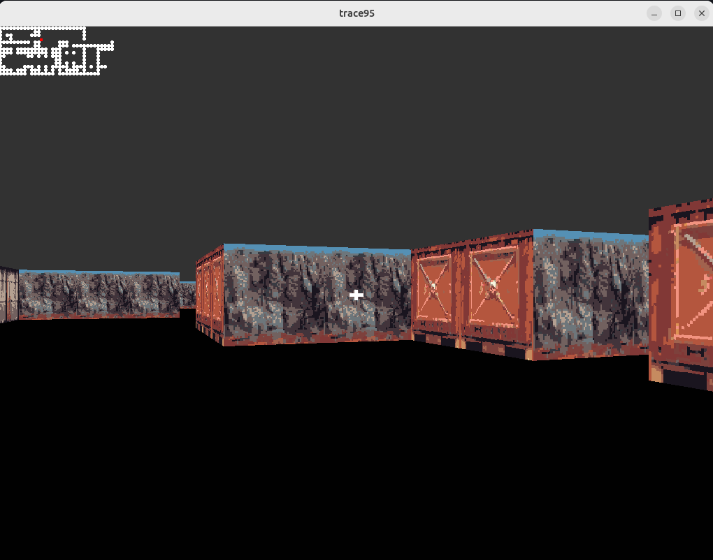

# trace95

A tiny, old-school raycasting walking sim built with C++17 and SFML 2.6. Think pseudo-3D corridors, WASD movement, collision & free textures.

It's meant to be a hackable, fun project :)

trace like "trace rays", 95 like it's 1995 (felt creative)

## ✨ What's inside?

- 2.5D raycasting renderer (DDA)

- Textured walls & floor/ceiling colors

- WASD + mouse/arrow look

- Simple collision

- Mini-map overlay

- The crosshair, will certainly change 

## 📸 Preview



## 🛠️ Requirements

C++17 compiler (GCC 10+, Clang 12+, MSVC 19.3+)
CMake
SFML 2.6.x (graphics, window, system)

### 📦 Getting SFML
Windows (vcpkg): vcpkg install sfml

macOS (Homebrew): brew install sfml

Linux (Debian/Ubuntu): sudo apt install libsfml-dev

Or build SFML from source if you have too much spare time :3

## 🚀 Run on Linux / MacOS
Clone
```bash
git clone https://github.com/bobbyskywalker/trace95.git
cd trace95
```

Configure & build (CMake)
``` bash
mkdir build
cd build
cmake ..
make
cd bin
./trace95 <path_to_map>
```

## 🎮 Controls, obvious ones lol why are u reading this?

- W/A/S/D — move / strafe

- ← / → — look left/right

- esc — quit

## 🤝 Contributing

Yes, PR it- maybe I'll learn something :)

🙌 Credits

- Inspired by Doom (how original)
- SFML is cool
- Great tutorial: https://lodev.org/cgtutor/raycasting.html

## 📄 License

MIT — do whatever, just don’t sue.
